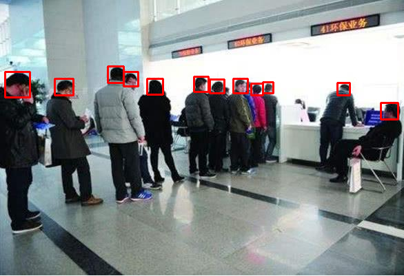
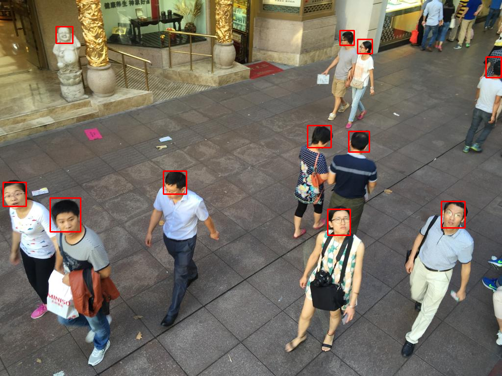

# FCHD
本工程是官方工程的python3版本，重构了部分代码，并训练得到了一个效果不错的模型。

> 论文地址：https://arxiv.org/abs/1809.08766  
> 官方工程地址：https://github.com/aditya-vora/FCHD-Fully-Convolutional-Head-Detector

## 安装 
1. Clone
    ```
    git clone https://github.com/embracesource-cv-com/FCHD.git
    ```
2. 安装依赖
    ```
    cd FCHD
    pip install -r requirements.txt
    ```


## 数据配置
1. 在[此处](https://pan.baidu.com/s/1-rGZD9gWT7wR2lLnrGHljw)下载Brainwash数据集，caffe预训练模型，以及人头检测模型
2. 将预训练模型vgg16_caffe.pth放到./checkpoints/pre_trained目录下
3. 将检测模型checkpoint_best.pth放到./checkpoints目录下
4. 将brainwash数据集放到/home/dataset/fchd_datas目录下  
> 当然你可以自定义各个路径，然后在config.py中修改相应的配置

## 预测
    ```
    python predict.py -p [path of image]
    ```

## 训练
1. 打开可视化工具visdom:
    ```
    python -m visdom.server
    ```
2. 开始训练:
    ```
    python train.py 
    ```

# 检测效果

